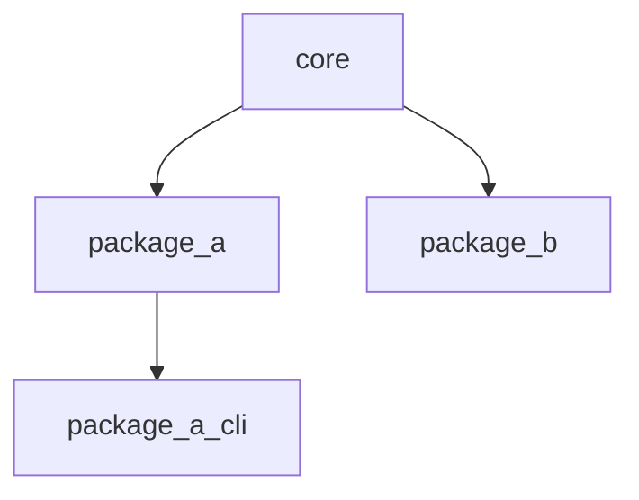

# Architecture and ownership

## Component model

Both language stacks demonstrate the same dependency direction:



- `core` defines shared value types, status contracts, and low-level utilities.
- `package_a` and `package_b` are sibling domain packages. They can depend on `core`, but not on
  one another.
- `package_a_cli` is an application boundary and may depend on `package_a`. Libraries must never
  depend on applications.

These rules keep changes local, make ownership clear, and avoid a collection of packages that is
a monolith in disguise.

## Python conventions

Each Python component is a PEP 517 project with its own `pyproject.toml`, `src` layout, import
namespace, dependencies, and tests. The repository root owns only shared development policy and
the uv workspace.

Use normalized distribution names and unambiguous organization-prefixed import names:

| Component | Distribution | Import package |
| --- | --- | --- |
| Core | `example-core` | `example_core` |
| Package A | `example-package-a` | `example_package_a` |
| Package B | `example-package-b` | `example_package_b` |
| Package A CLI | `example-package-a-cli` | `example_package_a_cli` |

Every dependency must appear in the consuming member's `[project].dependencies`, even though a
shared development environment may make undeclared imports appear to work locally.

Each component owns documentation beneath its own `docs` directory. The repository-level Sphinx
site assembles those pages without moving component-specific guidance into a central hierarchy.

## Native conventions

Native libraries expose behavioural and generated version headers under a namespaced include tree,
such as `<example/package_a.h>` and `<example/package_a_version.h>`. Consumers link through
namespaced CMake aliases:

```cmake
target_link_libraries(my_target PRIVATE example::package_a)
```

Each production target receives warnings, the C17 requirement, optional sanitizers, and
static-analysis integration through `monorepo_set_project_options`. CppUTest targets receive the
corresponding test-only C++17 policy. Target-level policy avoids leaking internal compiler flags
into external consumers.

Native library tests use CppUTest and are registered with CTest; application boundary tests remain
direct CTest process checks. CppUTest is fetched only for test-enabled builds and is excluded from
installed artifacts. Public C headers use `extern "C"` guards so both the harness and downstream
C++ programs can link to the C implementation.

## Adding a Python package

1. Copy an existing directory under `python/packages`.
2. Give the distribution and import package organization-unique names.
3. Add the member to `[tool.uv.workspace].members` if it is outside the existing glob.
4. Declare workspace dependencies normally and add their sources to `[tool.uv.sources]`.
5. Add the project path to `scripts/check_python.py`.
6. Run `uv lock`, then the Python quality and test commands.

## Adding a native package

1. Create `native/packages/<name>/{include,src,tests}`.
2. Define a library and namespaced alias in its `CMakeLists.txt`.
3. Add a component-owned version-header template and register it with
   `monorepo_add_version_header`.
4. Apply `monorepo_set_project_options` to production C targets and
   `monorepo_set_cpp_test_options` to CppUTest executables.
5. Link only to explicitly declared targets and register the test with CTest.
6. Add the directory to the root `CMakeLists.txt`.
7. Run the developer, analysis, sanitizer, and coverage presets.

## Cross-language integration

Keep cross-language communication at explicit boundaries. If Python calls a C executable, test
the executable's command-line or protocol contract in an integration suite. If native bindings
are eventually required, create a dedicated Python distribution for that binding rather than
making every Python package depend on the native build.
